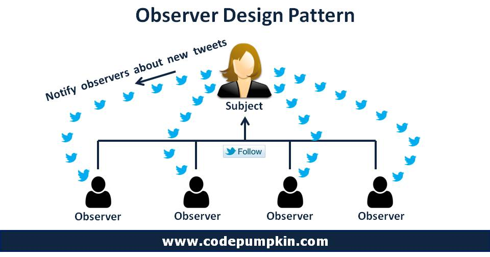

### 옵저버 패턴

정의 : 옵저버 패턴은 지속적으로 변하는 값을 다룰 때 사용된다.

예시 : 예컨데 1분에 한번씩 변하는 온도 센서가 있다고 보자. 온도 센서를 
지속적으로 보고 있으면, 에너지 소모량도 많고, 효율이 떨어진다. 
온도 센서 값이 변할때, 센서가 직접 알려줄 수는 없을까?

구성 : 옵저버 패턴은 2가지로 구성된다. 
데이터의 소스(source, 원천)와 옵저버(observer, 관찰자)
소스를 어떤 것들이 보고 있을지 등록을 하면, 
소스는 값이 변할 때마다 관찰자에게 알려준다. 

예 : 넷플릭스 구독
1. 넷플릭스(소스)를 보고 싶은 사람은 구독을 합니다. 
2. 새로운 시리즈가 나오면 넷플릭스는 구독자(옵저버)에게 알려줍니다. 
3. 구독자는 넷플릭스를 그만보고 싶으면 구독을 해지합니다. 
4. 넷플릭스는 얼마든지 구독자를 추가하거나 취소할 수 있습니다.

-