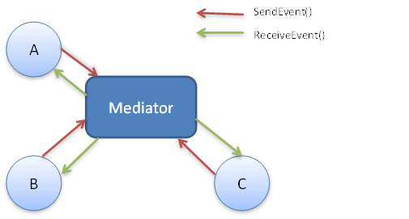

### 미디에이터 패턴(Mediator Pattern)

####미디에이터 패턴이란?
미디에이터 패턴은 서로 관련된 객체 사이의 복잡한 통신과 
제어를 한 곳으로 집중하고자 할 때 쓰인다.  

####언제 쓰일까?
예를 들면, 일상 생활에서 여러명한테 연락할때 
한 사람 한 사람에게 말하는 것보다, 단체 채팅(카톡방)을 통해 
말하는 게 수월하듯이, 중간에 거치는 통로 및 관리자 둔다고 보면 된다.  

#### 예시
비행기가 이착률을 하는 상황을 생각해보자.
각각의 비행기가 서로 어디에 있는지 확인하면서
착륙을 하려면 비행기끼리 해야할 소통량이 
어마어마하게 커질 것이다. 
따라서 관제탑에서 비행기가 끼리의 통신을 대신해준다. 
미디에이터 패턴도 마찬가지이다. 


여러 객체가 있을 때, Mediator를 통해 
객체 간의 통신과 제어를 편하게 한다.



Mediator 패턴은 2가지로 구성된다

1. Colleague - Mediator와 통신하는 객체
2. Mediator - 명령을 처리하고, Colleague에 알려주는 객체

각각이 어떻게 구현되었는지 보도록 하자.
여기서 만들 예제는 주식을 사고 파는 시스템이다. 

```java
public interface Mediator {
    void sellOffer(String stock, int shares, int collCode);
    void buyOffer(String stock, int shares, int collCode);
    void addColleague(Collegue collegue);
}
```

Mediator에서 각 객체에서 할 동작들을 정해준다. 
주식 거래 시스템이기에, 주식을 사고 파는 함수를 정의해준다. 

```java
public abstract class Colleague {
    private Mediator mediator;
    private int collCode;

    public Collegue(Mediator mediator) {
        this.mediator = mediator;
        mediator.addColleague(this);
    }

    public void sellOffer(String stock, int shares) {
        mediator.sellOffer(stock, shares, this.collCode);
    }

    public void buyOffer(String stock, int shares) {
        mediator.buyOffer(stock, shares, this.collCode);
    }

    public void setCollCode(int collCode) {
        this.collCode = collCode;
    }
}
```

Colleague는 Mediator와 연결되어 있으며 실제 처리는 Mediator에서 하고 있다. 


```java
public class StockOffer {
    private int stockShares = 0;
    private String stockSymbol = "";
    private int colleagueCode = 0;

    public StockOffer(int stockShares, String stockSymbol, int colleagueCode) {
        this.stockShares = stockShares;
        this.stockSymbol = stockSymbol;
        this.colleagueCode = colleagueCode;
    }

    public int getStockShares() {
        return stockShares;
    }

    public String getStockSymbol() {
        return stockSymbol;
    }

    public int getColleagueCode() {
        return colleagueCode;
    }
}
```

주식 거래를 위한 Data 클래스를 정의해주었다.
이제 기본 클래스를 통해 주식 거래 시스템을 만들어보도록 하자.

```java
public class JPMorgan extends Colleague {
    public JPMorgan(Mediator mediator) {
        super(mediator);
        System.out.println("JP Morgan Signup with the stock exchange");
    }
}
```

```java
public class GoldmanSocks extends Colleague {
    public GoldmanSocks(Mediator mediator) {
        super(mediator);
        System.out.println("Goldman Socks Signup with the stock exchange");
    }
}
```

Colleague를 구체적으로 구현한 클래스이다.
어떤 주식 회사를 이용하는지 표현하기 위해 만들었다. 


```java
public class StockMediator implements Mediator {

    ArrayList<Colleague> collegues;
    ArrayList<StockOffer> stockBuyOffers;
    ArrayList<StockOffer> stockSalesOffers;

    private int collegueCodes = 0;

    public StockMediator() {
        this.collegues = new ArrayList<>();
        this.stockBuyOffers = new ArrayList<>();
        this.stockSalesOffers = new ArrayList<>();
    }

    @Override
    public void addColleague(Colleague newCollegue) {
        collegues.add(newCollegue);
        collegueCodes++;
        newCollegue.setCollCode(collegueCodes);
    }

    @Override
    public void sellOffer(String stock, int shares, int collCode) {
        boolean stockSold = false;

        for(StockOffer offer : stockSalesOffers) {
            if ((offer.getStockSymbol() == stock) && (offer.getStockShares() == shares)) {
                System.out.println(shares + " shares of " + stock +
                                " sold to " + offer.getColleagueCode());
                stockBuyOffers.remove(offer);
                stockSold = true;
            }
            if (stockSold) {
                break;
            }
        }

        if (!stockSold) {
            System.out.println(shares + " shares of " + stock +
                            " added to inventory");
            StockOffer newOffering = new StockOffer(shares, stock, collCode);
            stockSalesOffers.add(newOffering);
        }
    }

    @Override
    public void buyOffer(String stock, int shares, int collCode) {
        boolean stockBought = false;

        for(StockOffer offer : stockBuyOffers) {
            if ((offer.getStockSymbol() == stock) && (offer.getStockShares() == shares)) {
                System.out.println(shares + " shares of " + stock +
                        " bought to " + offer.getColleagueCode());
                stockSalesOffers.remove(offer);
                stockBought = true;
            }

            if (stockBought) {
                break;
            }
        }

        if(!stockBought) {
            System.out.println(shares + " shares of " + stock +
                    " added to inventory");
            StockOffer newOffering = new StockOffer(shares, stock, collCode);
            stockBuyOffers.add(newOffering);
        }
    }

    public void getStockOffering() {
        System.out.println("\nStock for Sales");
        for(StockOffer offer: stockSalesOffers) {
            System.out.println(offer.getStockShares() + " of " + offer.getStockSymbol());
        }
        System.out.println("\nStock Buy Offers");
        for(StockOffer offer: stockBuyOffers) {
            System.out.println(offer.getStockShares() + " of " + offer.getStockSymbol());
        }
    }
}
```

주식을 하나 살 때마다, 팔 때마다 
각각의 객체(Colleague)를 업데이트하도록 구성되었다.


```java
public class TestStockMediator {
    public static void main(String[] args) {
        StockMediator nyse = new StockMediator();

        GoldmanSocks broker = new GoldmanSocks(nyse);
        JPMorgan broker2 = new JPMorgan(nyse);

        broker.buyOffer("Microsoft", 100);
        broker.buyOffer("Google", 50);

        broker2.buyOffer("Facebook", 100);
        broker2.buyOffer("Apple", 200);

        nyse.getStockOffering();
    }
}

```


### 퍼사드 패턴과 차이는?
- 퍼사드 패턴은 여러 객체의 동작을 모으는 인터페이스를 만드는 것이지
여러 객체 간의 통신, 제어를 담당하지는 않는다. 

- 퍼사드 패턴은 좋게 작성되지 않은 API를 감싸는 역할을 한다. 

### 옵저버 패턴과의 차이는?
- 옵저버 패턴은 관찰 대상에 변화가 있을 때 이를 알려주는 일을 하는 것이지
서로 다른 객체 간의 통신을 하는 것은 아니다.  


참고 : http://www.newthinktank.com/2012/10/mediator-design-pattern-tutorial/
